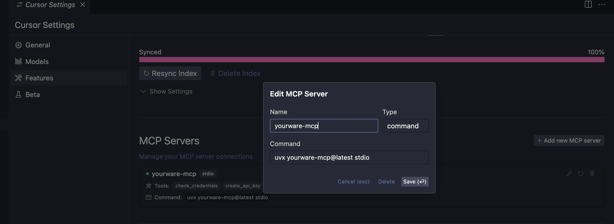

[](https://img.shields.io/github/v/release/ai-zerolab/yourware-mcp)
[](https://github.com/ai-zerolab/yourware-mcp/actions/workflows/main.yml?query=branch%3Amain)
[](https://img.shields.io/github/commit-activity/m/ai-zerolab/yourware-mcp)
[](https://img.shields.io/github/license/ai-zerolab/yourware-mcp)

<!-- [](https://codecov.io/gh/ai-zerolab/yourware-mcp) -->

# Yourware MCP

MCP server to upload your project to [yourware](https://www.yourware.so). Support single file or directory.

<a href="https://glama.ai/mcp/servers/@ai-zerolab/yourware-mcp">
  
</a>

## Showcase

Visit on [yourware](https://v9gfmmif5s.app.yourware.so/): https://v9gfmmif5s.app.yourware.so/


## Pre-requisites

1. You need to login to [yourware](https://www.yourware.so)
1. Then you can create a new API key, and set the `YOURWARE_API_KEY` environment variable. Don't worry, you chat with LLM to create and store the API key.

## Configuration

### General configuration

You can use the following configuration for cline/cursor/windsurf...

```json
{
  "mcpServers": {
    "yourware-mcp": {
      "command": "uvx",
      "args": ["yourware-mcp@latest", "stdio"],
      "env": {}
    }
  }
}
```

### Cursor config guide

In cursor settings -> features -> MCP Servers, Add a new MCP Server, name it `yourware-mcp` and set the command to `uvx yourware-mcp@latest stdio`



### Config claude code

```bash
claude mcp add yourware-mcp -s user -- uvx yourware-mcp@latest stdio
```

## Available environments variables

`YOURWARE_API_KEY` for the API key, you can also let llm config it for you.
